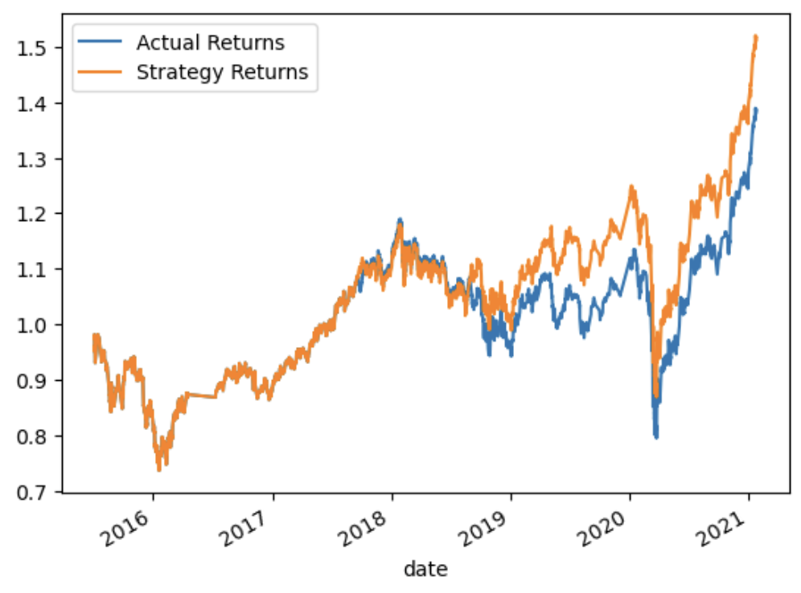
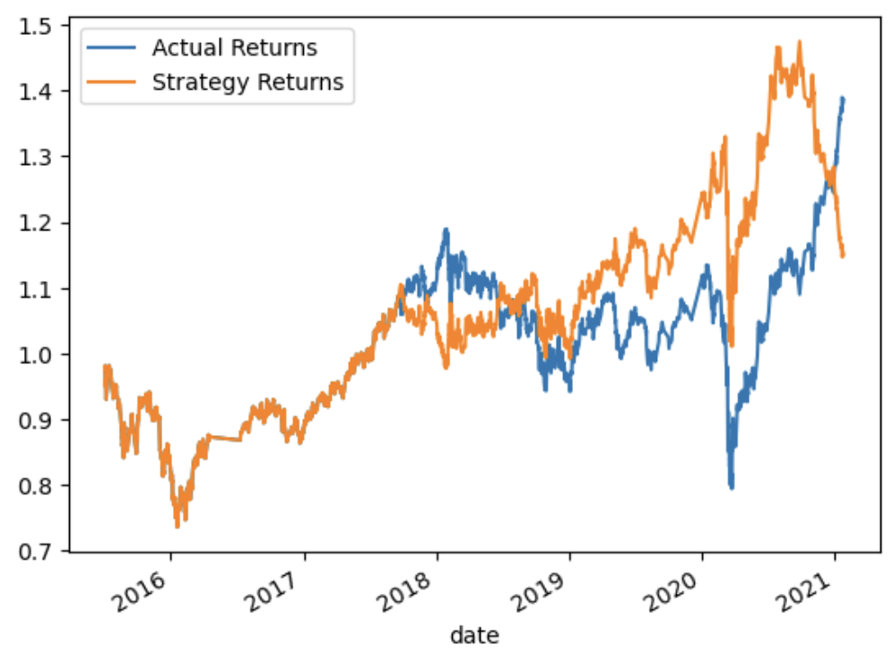

# Machine Learning Trading Bot

## Background

In this Challenge, you’ll assume the role of a financial advisor at one of the top five financial advisory firms in the world. Your firm constantly competes with the other major firms to manage and automatically trade assets in a highly dynamic environment. In recent years, your firm has heavily profited by using computer algorithms that can buy and sell faster than human traders.

The speed of these transactions gave your firm a competitive advantage early on. But, people still need to specifically program these systems, which limits their ability to adapt to new data. You’re thus planning to improve the existing algorithmic trading systems and maintain the firm’s competitive advantage in the market. To do so, you’ll enhance the existing trading signals with machine learning algorithms that can adapt to new data.

## What You're Creating

You’ll combine your new algorithmic trading skills with your existing skills in financial Python programming and machine learning to create an algorithmic trading bot that learns and adapts to new data and evolving markets.

In a Jupyter notebook:

* Implement an algorithmic trading strategy that uses machine learning to automate the trade decisions.

* Adjust the input parameters to optimize the trading algorithm.

* Train a new machine learning model and compare its performance to that of a baseline model.

As part of your GitHub repository’s `README.md` file, you will also create a report that compares the performance of the machine learning models based on the trading predictions that each makes and the resulting cumulative strategy returns.

## Files

The `machine_learning_trading_bot.ipynb` file contains my analysis of the `emerging_markets_ohlcv.csv` file and the preparation and optimization of ML models utilizing OHLCV data..
* [ML Trading Bot Notebook](Code/machine_learning_trading_bot.ipynb)
* [CSV File](Data/emerging_markets_ohlcv.csv)

> **Note:** The provided CSV file contains OHLCV data for an MSCI&ndash;based emerging markets ETF that [iShares](https://www.ishares.com/us/products/268704/ishares-currency-hedged-msci-emerging-markets) issued. Investments in emerging markets make up an important aspect of a well-diversified investment portfolio. This is because the included equities have potentially higher long-term returns, even though they carry more risk.

## Evaluation Report
---
Following analysis of the predictions generated by the two models, I can infer that the `SVC` classifier model produced through the `SKLearn` Support Vector Machine (SVM) learning module demonstrates a more effective model for profitable predictions compared to the `LogisticRegression` classifier model through `SKLearn`. Observing the respective plots of predicted Strategy Returns vs. Actual Returns between the two models, we can see the predicted returns in SVM model closely correlating to the actual returns, ultimately returning slightly higher predictive return values than actual returns. In contrast, the LogisticRegression model trended in a far more variable manner and ultimately did not correlate well with actual returns by 2020, demonstrating significantly lower Strategy Returns than Actual Returns.

* Support Vector Machine (SVM) Model

* LogisticRegression Model

---